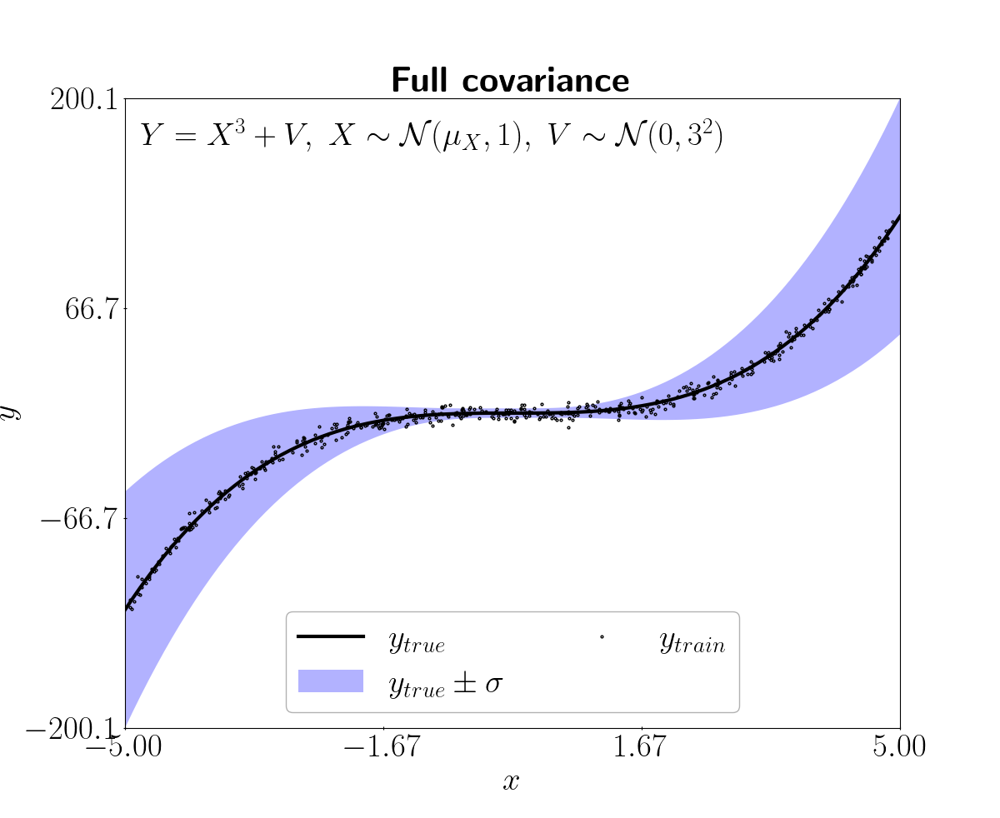
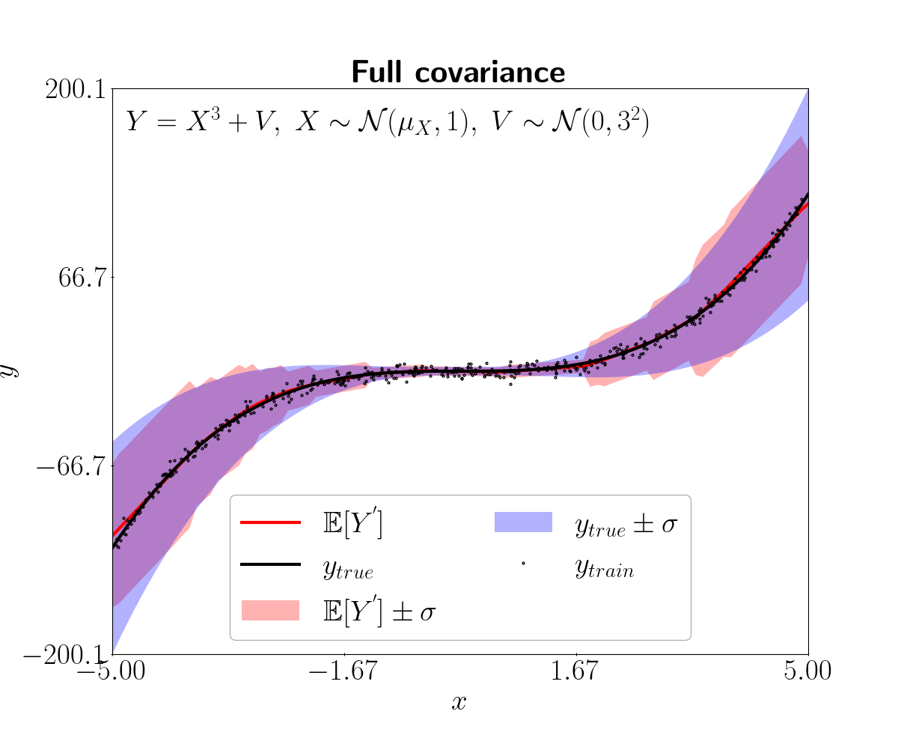

# 1D toy regression problem with input-layer uncertainty

**Author:** [Miquel Florensa](https://www.linkedin.com/in/miquel-florensa/)  
**Date:** 2023/05/10  
**Description:** This example shows how to perform a 1D toy regression problem with uncertainty on the input layer. This task requires considering full covariance matrices for the hidden layers.  

<a href="https://github.com/lhnguyen102/cuTAGI/blob/main/python_examples/fullcov_regression_runner.py" class="github-link">
  <div class="github-icon-container">
    
  </div>
  <div class="github-text-container">
    Github Source code
  </div>
</a>

---

## 1. Setup

```python
from visualizer import PredictionViz

from python_examples.data_loader import RegressionDataLoader
from python_examples.model import FullCovMLP
from python_examples.regression import Regression
```

?>Notice that these modules are described [here](modules/modules.md) and the source code is in the *python_examples* directory, in case you have these modules in another directory you must change this paths.

## 2. Prepare the data

In this simple example we will use a 1D toy dataset. The data is generated from a polynomial function with additive random observation errors. The goal is to learn the function from the data and then to return it while considering the uncertainty on the input layer variable.

```python
# User-input
num_inputs = 1      # 1 explanatory variable
num_outputs = 1     # 1 predicted output
num_epochs = 50     # row for 50 epochs
x_train_file = "./data/toy_example/x_train_1D_full_cov.csv"
y_train_file = "./data/toy_example/y_train_1D_full_cov.csv"
x_test_file = "./data/toy_example/x_test_1D_full_cov.csv"
y_test_file = "./data/toy_example/y_test_1D_full_cov.csv"
```

**You can find the data used in the [toy_example data](https://github.com/lhnguyen102/cuTAGI/tree/main/data/toy_example) in the repository.*

?>We can plot the training datapoints and the function we want to learn along with the theoretical confidence interval caused by the presence of uncertainty on the input layer.



## 3. Create the model

We use a FNN with a simple architecture as defined in the FullCovMLP class wich is suited for this basic regression problem with full covariance matrices for the hidden layers. Find out more about the [FullCovMLP class](modules/models?id=full-covariance-regression-mlp-class).

```python
# Model
net_prop = FullCovMLP()
```

> If you want to use a different model, you can create your own class and make sure that it inherits from the NetProp class, more information in [models page](modules/models?id=netprop-class).

## 4. Load the data

We will make use of the [RegressionDataLoader](modules/data-loader?id=data-loader) class to load and process the data. The *process_data* function requires the input and output test and training files in a **csv** format.

```python
# Data loader
reg_data_loader = RegressionDataLoader(num_inputs=num_inputs,
                                       num_outputs=num_outputs,
                                       batch_size=net_prop.batch_size)
                                       
data_loader = reg_data_loader.process_data(x_train_file=x_train_file,
                                           y_train_file=y_train_file,
                                           x_test_file=x_test_file,
                                           y_test_file=y_test_file)
```

## 5. Create visualizer

In order to visualize the predictions of the regression we use the PredictionViz class. This class creates a window with the true function, the predicted expected values and the confidence interval.

```python
viz = PredictionViz(task_name="full_cov_regression", data_name="toy1D")
```

> Learn more about PredictionViz class [here](https://github.com/lhnguyen102/cuTAGI/blob/main/visualizer.py).

## 6. Train and evaluate the model

Using the [regression class](modules/regression?id=regression-class) we train and test the model using TAGI. When doing the prediction step we can specify the standard deviation factor to define the confidence intervals.

```python
reg_task = Regression(num_epochs=num_epochs,
                      data_loader=data_loader,
                      net_prop=net_prop,
                      viz=viz)

reg_task.train()
reg_task.predict()
```

## 7. Visualize the results

At the end of the execution the results are printed in the console as seen below.

> MSE           :  2.96  
> Log-likelihood: -3.67

?> If you have created the visualization object and passed it to the regression object, a new window will pop up with the results.



**The black line is the true function, the red line is the predicted expected values and the red region is the confidence interval including the epistemic uncertainty associated with the network parameter and the aleatory one associated with the input-layer uncertainty. The purple region is the theoretical confidence interval caused by the presence of uncertainty on the input layer*
