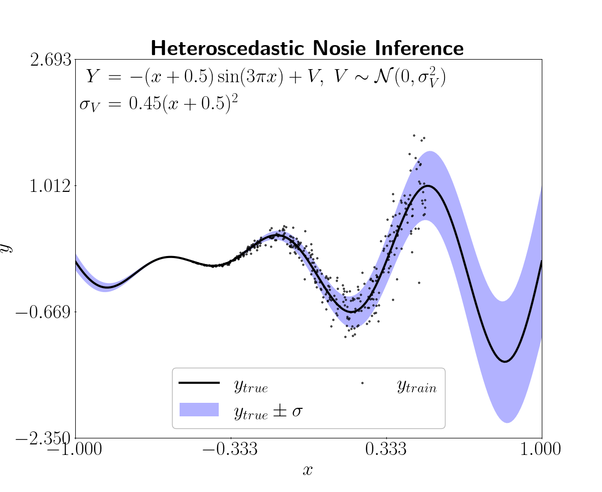
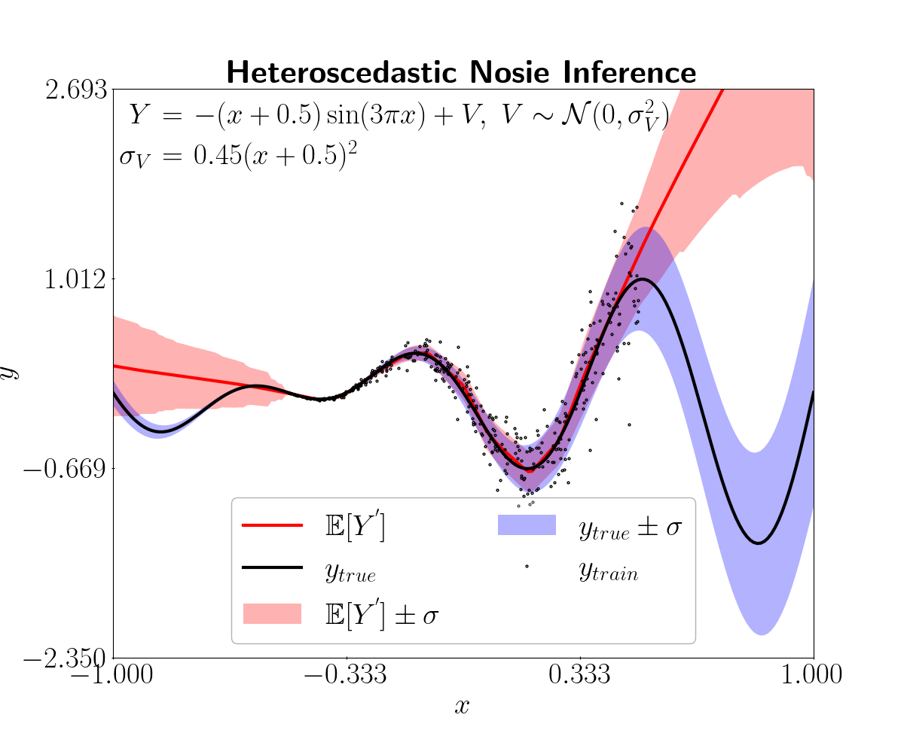

# 1D toy regression problem with heteroscedasticity

**Author:** [Miquel Florensa](https://www.linkedin.com/in/miquel-florensa/)  
**Date:** 2023/03/14  
**Description:** This example shows how to perform a 1D toy regression problem with heteroscedasticity using a FNN.  

<a href="https://github.com/lhnguyen102/cuTAGI/blob/main/python_examples/heteros_regression_runner.py" class="github-link">
  <div class="github-icon-container">
    
  </div>
  <div class="github-text-container">
    Github Source code
  </div>
</a>

---

## 1. Setup

```python
from visualizer import PredictionViz

from python_examples.data_loader import RegressionDataLoader
from python_examples.model import HeterosMLP
from python_examples.regression import Regression
```

?>Notice that these modules are described [here](modules/modules.md) and the source code is in the *python_examples* directory, in case you have these modules in another directory you must change this paths.

## 2. Prepare the data

In this simple example we use a 1D toy dataset. The data is generated from a polynomial function with additive heteroscedastic observation errors. The goal is to learn from the data an expected value and an heteroscedasty function to describe the responses along with their covariate-dependent uncertainty.

```python
# User-input
num_inputs = 1      # 1 explanatory variable
num_outputs = 1     # 1 predicted output
num_epochs = 50     # row for 50 epochs
x_train_file = "./data/toy_example/x_train_1D_noise_inference.csv"
y_train_file = "./data/toy_example/y_train_1D_noise_inference.csv"
x_test_file = "./data/toy_example/x_test_1D_noise_inference.csv"
y_test_file = "./data/toy_example/y_test_1D_noise_inference.csv"
```

**You can find the data used in the [toy_example data](https://github.com/lhnguyen102/cuTAGI/tree/main/data/toy_example) in the repository.*

?>We plot the training datapoints and the function we want to learn along with its theoretical heteroscedastic confidence interval.



## 3. Create the model

We use a FNN with a simple architecture as defined in the HeterosMLP class wich is suited for this basic regression problem with heteroscedasticity. Find out more about the [HeterosMLP class](modules/models?id=heteroscedastic-regression-mlp-class).

```python
# Model
net_prop = HeterosMLP()
```

> If you want to use a different model, you can create your own class and make sure that it inherits from the NetProp class, more information in [models page](modules/models?id=netprop-class).

## 4. Load the data

We will make use of the [RegressionDataLoader](modules/data-loader?id=data-loader) class to load and process the data. The *process_data* function requires the input and output test and training files in a **csv** format.

```python
# Data loader
reg_data_loader = RegressionDataLoader(num_inputs=num_inputs,
                                       num_outputs=num_outputs,
                                       batch_size=net_prop.batch_size)
                                       
data_loader = reg_data_loader.process_data(x_train_file=x_train_file,
                                           y_train_file=y_train_file,
                                           x_test_file=x_test_file,
                                           y_test_file=y_test_file)
```

## 5. Create visualizer

In order to visualize the predictions of the regression we use the PredictionViz class. This class creates a window with the true function, the predicted function and the confidence intervals.

```python
viz = PredictionViz(task_name="heteros_regression", data_name="toy1D")
```

> Learn more about PredictionViz class [here](https://github.com/lhnguyen102/cuTAGI/blob/main/visualizer.py).

## 6. Train and evaluate the model

Using the [regression class](modules/regression?id=regression-class) we train and test the model with TAGI. When doing the prediction step we can specify the standard deviation factor to define the confidence interval.

```python
reg_task = Regression(num_epochs=num_epochs,
                      data_loader=data_loader,
                      net_prop=net_prop,
                      viz=viz)

reg_task.train()
reg_task.predict()
```

## 7. Visualize the results

At the end of the execution the results are printed in the console as seen below.

> MSE           :  2.10  
> Log-likelihood: -0.15

?> If you have created the visualization object and passed it to the regression object, a new window will pop up with the results.



**The black line is the true function and the purple region is the true heteroscedastic confidence interval; the red line is the predicted expected values and the red region is the heteroscedastic confidence interval including both epistemic and aleatory uncertainties.*
